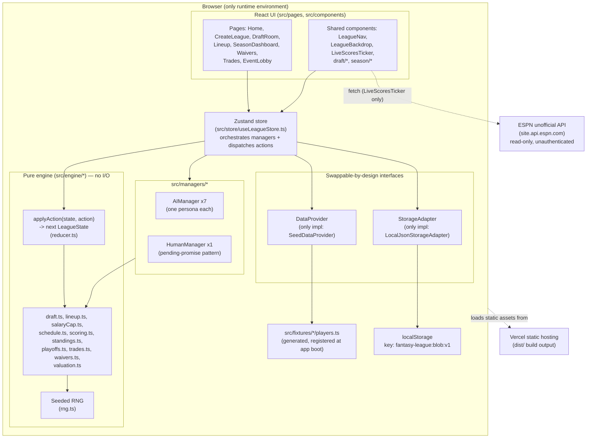

# ARCHITECTURE.md

## System overview

Fantasy League is a **pure client-side single-page application**. There is no server component, no database, no authentication service. Everything — the UI, the fantasy-sports simulation engine, and persistence — runs in the user's browser. The only network call the app makes is an optional, best-effort fetch to ESPN's public unofficial scoreboard API for a read-only "live scores today" widget; nothing else touches the network.

The application's core design principle (stated directly in `README.md` and verified throughout the codebase) is: **`applyAction(state, action) -> LeagueState` is the only place state changes, it is pure, and every user-visible event is a serializable `Action` run through it.** This, combined with a seeded RNG where every random draw is cursor-addressed, makes an entire fantasy season fully deterministic and replayable from `(seed, actionLog)` alone. This property is not currently exercised by any UI feature except `undoLastAction` (implemented, unused by any button), but it is the reason several other seams exist (see "Architectural risks" below and `DECISIONS.md`).

## Architecture diagram

## Frontend structure

- **Entry**: `index.html` → `src/main.tsx` (imports `src/fixtures` once for its side effect of calling `registerFixtures()` for all 10 sports, then mounts `<App/>` in `<StrictMode>`).
- **Routing**: `src/App.tsx` defines the full route table with `react-router-dom`'s `BrowserRouter`/`Routes`/`Route`. Every league-scoped route (`/league/:leagueId/*`) independently calls `loadLeague(leagueId)` from the store on mount via a `useEffect` guarded by `state?.id !== leagueId`.
- **Pages** (`src/pages/`): `HomePage` (league list), `CreateLeaguePage` (sport picker + league setup), `DraftRoomPage`, `LineupPage`, `SeasonDashboardPage`, `WaiversPage`, `TradesPage`, `EventLobbyPage` (the no-draft-sport equivalent of the draft room — where a fresh salary-cap field is picked each period).
- **Components**: page-agnostic shared UI directly under `src/components/` (`LeagueNav`, `LeagueBackdrop`, `LiveScoresTicker`, `sportMeta.ts` for icon/label lookups); page-specific pieces under `src/components/draft/` (best-available list, pick feed, roster grid, position-need panel, draft clock) and `src/components/season/` (standings table, matchup results, playoff bracket view).

## Backend structure

**None.** There is no server process, no API route handler, no middleware. This section is intentionally short because there is nothing here to document beyond: the entire "backend" is the pure-function engine described below, executed synchronously in the browser tab.

## Server/client boundaries

There are none today — everything is client. The codebase is deliberately shaped so that a boundary *could* be introduced later without a rewrite:

- `applyAction`/`createEmptyLeagueState` (`engine/reducer.ts`) have no dependency on `window`, `localStorage`, or React — they could run in a Node process unchanged.
- `Manager` (interface in `types.ts`) is implemented by `AIManager` (pure local logic) and `HumanManager` (resolves via a pending promise the UI fulfills). A hypothetical `RemoteManager` implementing the same interface via a websocket message is the documented (in `README.md`) path to multiplayer — see `DECISIONS.md`.
- `StorageAdapter` and `DataProvider` are both one-interface/one-implementation today, sized for a second (DB-backed, live-API-backed) implementation later.

**None of this exists yet.** Treat every mention of "future multiplayer" or "live data provider" in this documentation set as documented *intent/design headroom*, not a partially-built feature — grep confirms no `RemoteManager.ts`, no server entrypoint, no second `DataProvider`/`StorageAdapter` implementation exists in the repository.

## Request lifecycle / data flow

There is no HTTP request lifecycle for the app's own state. The lifecycle for a user action is:

1. User interacts with a page (clicks "Start Draft", drags/selects a lineup, clicks "Advance Week", proposes a trade, etc.).
2. The page calls a method on `useLeagueStore` (e.g. `startDraft()`, `saveHumanLineup()`, `advanceWeek()`, `proposeTrade()`).
3. That store method constructs a serializable `Action` object (`{ type, managerId, payload, timestamp }`) — for AI-driven steps (draft picks, AI lineups, AI trade responses), it first calls the relevant `Manager` method (async, may involve RNG draws) to produce the payload.
4. `applyAction(currentState, action)` is called — pure, synchronous, returns a brand-new `LeagueState` object (no mutation of the input).
5. The store calls `storage.save(id, nextState)` (writes the entire `localStorage` blob synchronously) then `set({ state: nextState })` (Zustand), which triggers React re-renders in every subscribed component.
6. Some flows repeat steps 2-5 in a loop without further user input — e.g. `runDraftLoop` advances through every AI team's turn automatically (with a cosmetic delay per pick so it doesn't feel instant), pausing only when it's the human's turn (via `HumanManager`'s pending-promise, raced against a countdown timer in `raceHumanPick`).

## Authentication flow

**None.** There is no login, no session, no account concept. "The human manager" for a given league is simply whichever browser loaded/created it — `localStorage` isolation per browser profile is the only thing standing in for user identity, and it provides no real security or portability (clearing browser data deletes all leagues permanently, with no recovery).

## Authorization flow

**None** — there's nothing to authorize against (single implicit user per browser).

## Database access flow

**No database.** See `DATABASE.md` for what plays the role of a schema (`LeagueState` in `types.ts`) and access pattern (`StorageAdapter`).

## Storage flow

1. On app load, `LocalJsonStorageAdapter`'s constructor calls `readBlob()`, which reads `localStorage.getItem('fantasy-league:blob:v1')`, JSON-parses it (or returns `{ leagues: {} }` if missing/unparseable — a parse error is swallowed silently, not surfaced), and caches the `leagues` map in memory.
2. Every `save(leagueId, state)` call updates the in-memory cache and immediately re-serializes and writes the **entire** blob back to `localStorage` (not a per-league write — there's no partial update).
3. `load(leagueId)` and `list()` read only from the in-memory cache (never re-reads `localStorage` mid-session) — so if a second tab modifies `localStorage`, this tab's cache goes stale until reload. This is a real (if minor, single-user-oriented) limitation, not yet addressed.

## External API flow

Only one: `src/utils/liveScores.ts`'s `fetchLiveScores(sport)`:

1. Maps the app's `SportId` to an ESPN URL path segment (`ESPN_PATH` record).
2. `fetch()`s `https://site.api.espn.com/apis/site/v2/sports/{path}/scoreboard` directly from the browser — no proxy, no API key, no request signing.
3. Normalizes the loosely-typed JSON response into one of two shapes depending on sport category: `{ kind: 'matchups', events: LiveMatchup[] }` for the 7 team-vs-team sports, or `{ kind: 'leaderboard', events: LiveLeaderboardEvent[] }` for the 3 individual-athlete sports (PGA, Tennis, NASCAR).
4. `LiveScoresTicker` (component) calls this on mount and every 60 seconds thereafter (via `setInterval`, cleaned up on unmount/sport-change), and renders nothing at all (not even an error message) if the fetch throws or returns zero events — deliberate silent-degradation design, since this is unofficial/best-effort external data, not a claim about the ESPN's public API's own stability.

## Real-time communication / multiplayer

**None exists.** See "Server/client boundaries" above — this is documented design headroom, not a built feature.

## Background jobs / scheduled jobs

**None** in the traditional sense (no cron, no queue, no worker process). The closest analog is the client-side `runDraftLoop` (auto-advances AI draft turns with a cosmetic delay) and the draft clock's `setInterval` countdown, both in `src/store/useLeagueStore.ts` — these are UI-thread timers, not background jobs, and stop entirely if the tab is closed (there is a page-reload resume path for a draft-in-progress — see `loadLeague`'s comment in `useLeagueStore.ts` — but no true background execution).

## Caching

**None** beyond the in-memory `StorageAdapter` cache described above. No HTTP cache layer, no service worker, no CDN-level cache configuration beyond whatever Vercel does by default for static assets.

## State management

One global Zustand store (`useLeagueStore`), described in "Request lifecycle" above. No React Context, no Redux, no other state library. Local component state (`useState`) is used for page-local UI concerns only (form inputs, selected tab, etc.) — never for anything that needs to survive a navigation or reload.

## Error handling

No centralized error boundary component exists in `src/`. Engine code throws descriptive `Error`s on invariant violations; most of these are not currently caught anywhere in the call chain from a store action back to the UI, meaning an unexpected engine error would currently manifest as an unhandled promise rejection / stuck UI state rather than a friendly error message. This is a real, if currently non-triggering (all invariants hold for the 10 registered sports), gap — see `KNOWN_ISSUES` in `CLAUDE.md`.

## Logging

None beyond the fixture-generator scripts' `console.log` (build-time only, not shipped) and whatever the browser's own console shows for uncaught errors.

## Analytics / Payments / Email

None of these exist in the codebase.

## Deployment architecture

Vite production build (`npm run build` → `tsc -b && vite build`, output to `dist/`) deployed as a static site to Vercel (`vercel --prod --yes`). No serverless functions, no edge middleware, no `vercel.json` (Vercel auto-detects the Vite framework preset). See `DEPLOYMENT.md`.

## Scaling considerations

Not applicable in the traditional sense — there is no server to scale, and each user's data lives entirely in their own browser, so there's no shared-state contention or database load to plan for. The only "scaling" concern that exists is client-side bundle size: `vite build` currently warns that the main JS chunk exceeds the 500kB (uncompressed) advisory threshold (≈947kB uncompressed / ≈177kB gzipped as of the NBA-addition build) due to bundling all 10 sports' fixture data (and background images, separately, as static assets) into one app — see `ROADMAP.md` for the un-actioned code-splitting suggestion Vite itself surfaces on every build.

## Security boundaries

See `SECURITY.md` for the full review. Summary: there is no server-side attack surface (no API routes, no database, no secrets to leak) — the entire threat model reduces to (a) the app is a static site with no user-supplied content rendered as HTML/executed as script beyond what React itself escapes by default, and (b) the one external network call (ESPN) is a `GET` to a fixed, hardcoded, read-only URL set with no user input reflected into it.

## Major architectural risks

1. **No `localStorage` schema versioning/migration** — a breaking change to `LeagueState`'s shape can silently corrupt or break every existing user's saved league with no upgrade path and no warning. See `CLAUDE.md` → "DO NOT CHANGE WITHOUT REVIEW".
2. **No error boundary** — an engine-level throw during a store action currently has no graceful UI fallback.
3. **Client-side-only "live scores"** — `LiveScoresTicker` depends on an unofficial, undocumented third-party API with inconsistent CORS support; if ESPN changes or blocks this endpoint entirely, the feature silently stops working with no alerting (by design — but worth knowing this dependency is inherently fragile).
4. **Bundle size** — all 10 sports' fixture data and every background image ship in the same build (Vite's advisory chunk-size warning is currently un-actioned). Not a functional risk today, but will get worse if more sports/backgrounds are added without addressing it (see `ROADMAP.md`).
