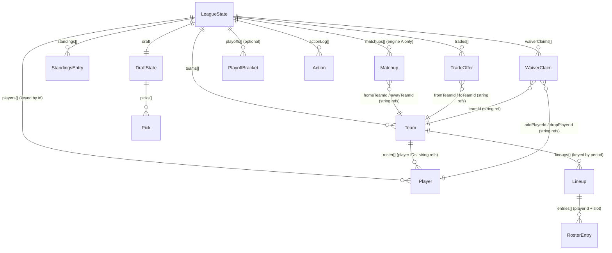

# DATABASE.md

## There is no database

This project has **no database of any kind** — no PostgreSQL, no SQLite, no MongoDB, no Firebase, no Supabase, nothing. No ORM, no migration tool, no schema file in the traditional sense. This is verified by inspection: no such dependency appears in `package.json`, no `.sql`/`.prisma`/`schema.*` files exist in the repository, and `src/storage/LocalJsonStorageAdapter.ts` (the only persistence implementation) confirms the entire persistence layer is a single browser `localStorage` key.

The rest of this document explains what plays the *role* a database schema would play, since a future agent will likely look here first when reasoning about "where does data live and what shape is it."

## Provider

**Browser `localStorage`**, accessed via `src/storage/LocalJsonStorageAdapter.ts`, which implements the `StorageAdapter` interface (`src/storage/StorageAdapter.ts`). This is a per-browser-profile store — not shared across devices, not shared across browsers on the same device, cleared if the user clears site data, with no backup/export feature.

## "Schema" source

There is no schema file — the closest equivalent is `src/types.ts`'s `LeagueState` interface (and everything it composes: `Team`, `Player`, `Draft State`, `Matchup`, `StandingsEntry`, `WaiverClaim`, `TradeOffer`, `Action`, etc.). Whatever shape `LeagueState` has at any given moment is exactly the shape every league in `localStorage` is stored in — TypeScript's compile-time type-checking is the only thing enforcing consistency, and only for *new writes*; there is no runtime validation of what's read back out of `localStorage` (a hand-edited or stale-shape blob would be trusted as-is).

## Storage key / "table" structure

Single key: `fantasy-league:blob:v1` (constant `STORAGE_KEY` in `LocalJsonStorageAdapter.ts`).

Value shape:
```ts
interface PersistedBlob {
  leagues: Record<string, LeagueState>   // keyed by league id (a crypto.randomUUID())
}
```

There is exactly one "table" (the `leagues` map) and no relational structure between rows beyond what's nested inside each `LeagueState` object itself (a league embeds its own teams, players, matchups, etc. — there's no separate "players table" referenced by foreign key; `LeagueState.players` is `Record<string, Player>`, and everything else references player IDs into that same map by string).

## "Entity" relationships (within one `LeagueState`)



All cross-references (`homeTeamId`, `addPlayerId`, `managerId`, etc.) are plain string IDs looked up at read time (e.g. `state.players[playerId]`, `state.teams.find(t => t.id === teamId)`) — there is no referential-integrity enforcement; a dangling reference (e.g. a `playerId` that doesn't exist in `state.players`) would simply resolve to `undefined` wherever it's looked up, and most call sites defensively optional-chain/filter it out rather than throwing.

## Important fields (LeagueState top level, from `types.ts`)

| Field | Purpose |
|---|---|
| `id` | league UUID, also the storage sub-key |
| `sport` / `config` | which sport + its full config snapshot (frozen at league-creation time — changing a sport's config later does NOT retroactively affect existing leagues, a deliberate behavior) |
| `seed` / `rngCursor` | determinism state — see `ARCHITECTURE.md` |
| `phase` | `setup \| predraft \| drafting \| regularSeason \| playoffs \| complete` |
| `currentPeriod` | which week/day/event the league is on |
| `teams` | array of 8 `Team` objects (1 human + 7 AI) |
| `managerPersonas` | manager ID → `AIPersona` (or `null` for the human) |
| `players` | the full player pool for this league, snapshotted at creation — **not** re-fetched from fixtures later, so regenerating a sport's fixtures does not affect any already-created league (see `DECISIONS.md`-adjacent note in `CLAUDE.md`/session history: this is exactly why "new names didn't show up" required creating a *new* league, not just regenerating fixtures) |
| `statLines` | every generated `StatLine` across the whole season, append-only |
| `draft` | draft order/picks/status |
| `matchups` / `standings` | engine-A results / all-engines leaderboard |
| `waiverClaims` / `trades` | full history, not just pending |
| `playoffs` | optional bracket array |
| `actionLog` | every `Action` ever applied — the full replay/audit trail |

## Indexes

None (no database engine to index). `list()` in `LocalJsonStorageAdapter` does a full in-memory `Object.values(cache)` scan + sort on every call — fine at the scale of "however many leagues one person creates in one browser," would not scale to many users/leagues without a real database.

## Migrations

**None exist.** See `CLAUDE.md`/`TASKS.md` TECH-1 — this is an open, documented gap: a breaking change to `LeagueState`'s shape has no upgrade path for already-saved leagues.

## Seed data

Not database seed data in the traditional sense, but the closest analog is the fixture-generation pipeline: `scripts/generate-<sport>-fixtures.mjs` + `scripts/data/<sport>-real-*.json` produce `src/fixtures/<sport>/players.ts`, which is what `SeedDataProvider` (note the name — "seed" here means "starting/fixture data," not "database seed script" in the ORM sense) serves as each sport's player pool at league-creation time. See `FILE_MAP.md` → "Add a sport."

## Row-level security / access patterns / ownership

Not applicable — there is no multi-tenant concept. Every league in a given browser's `localStorage` is implicitly "owned" by whoever has that browser open; there is no user-account boundary at all.

## Deletion / retention behavior

`StorageAdapter.delete(leagueId)` exists and is implemented (`LocalJsonStorageAdapter.delete`), but **no UI calls it anywhere in the codebase** (verified via `grep -r "\.delete(" src/pages src/components` — no matches). A league, once created, can currently only be removed by clearing the browser's site data entirely (which removes every league in that browser, not a selective delete).

## Known schema risks

- No versioning (see "Migrations" above).
- `LeagueState.config` snapshots the *entire* `SportConfig` at creation time, including the researched real player pool via `LeagueState.players` — this means the storage blob grows meaningfully with every league created (10 sports × up to 240 players each, with full nested projection data per player) and there's no pruning/archival for old/abandoned leagues.
- No encryption, no PII concern in practice (no user accounts, no personal data collected — the only "real" data stored is public sports roster information and the user's own chosen league/team names).
